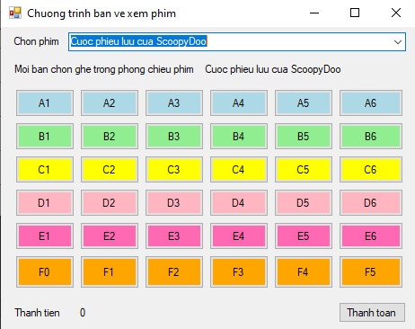
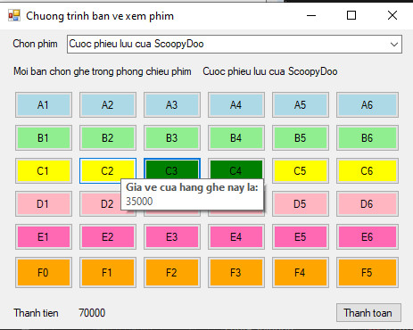
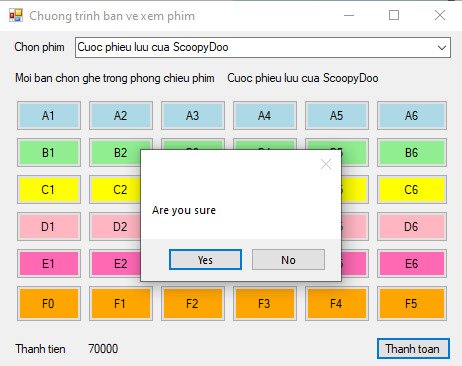
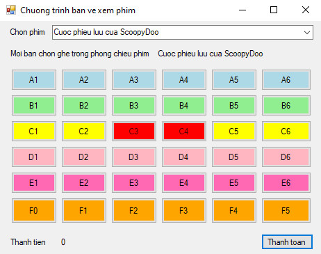

# Bài làm Demo

---

## 1. Chương trình chính - giao diện

## 3. Chương trình chính - vé được chọn

- ghế thành `màu xanh`

## 1. Chương trình chính - nhấn thanh toán

- hiển thị form xác nhận

## 1. Chương trình chính - thanh toán thành công

- ghế thành `màu đỏ` và `không thể chọn`, thành tiền trở về 0

