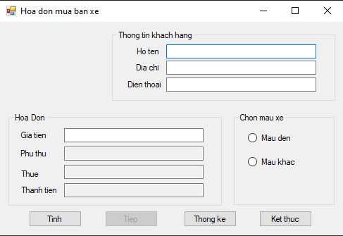

# Bài làm Demo

---

## 1. SQL - Demo bảng `TTHoaDon`

## 2. Chương trình chính - giao diện

## 3. Chương trình chính - thêm hoá đơn

## 4. Chương trình chính - thống kê

## 5. Chương trình chính - kết thúc

